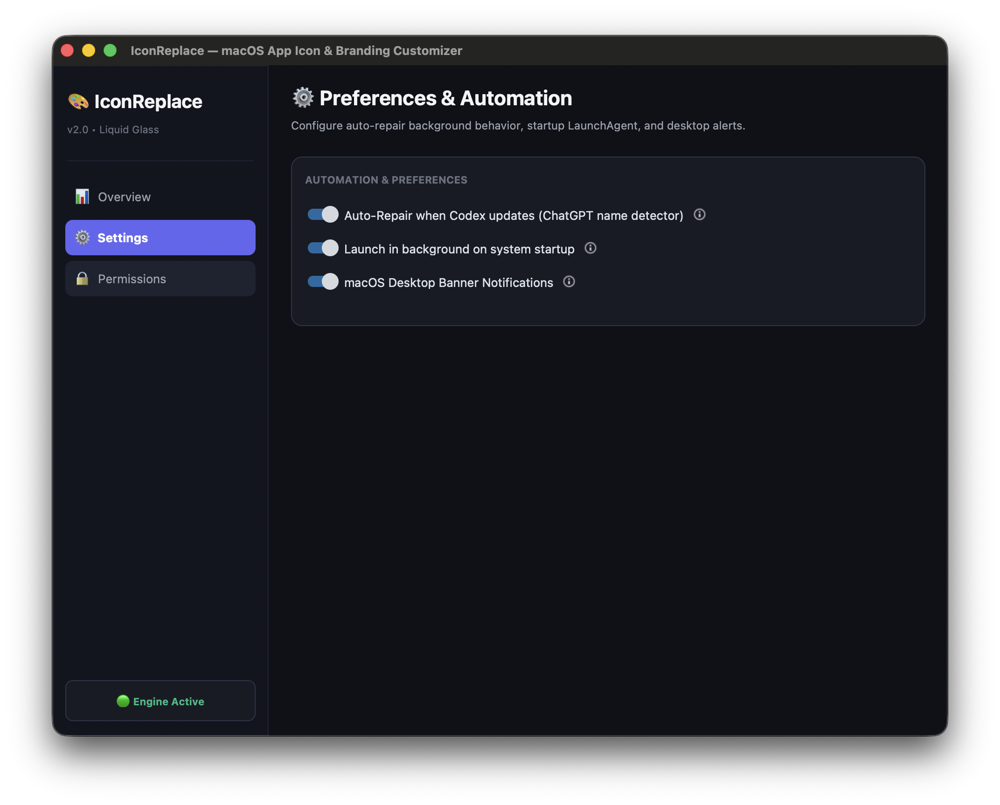

# IconReplace

> Native macOS application icon management utility with automated update persistence and backup verification.



## What it does

IconReplace changes macOS application icons and keeps them modified. 

I originally wrote this to solve the frustrating `ChatGPT -> Codex -> ChatGPT -> Codex` app renaming cycle. Every time the application updated and changed its name, macOS threw away my custom `.icns` file and reset the icon in the Dock. 

System updaters routinely overwrite custom `.icns` files inside `/Applications` during auto-updates. IconReplace prevents this reversion. It sets up lightweight `launchd` kernel file watchers (`WatchPaths`) pointing at the app bundles you care about. When an update overwrites your icon, the background LaunchAgent catches the file change and re-applies your custom icon instantly. It uses zero persistent CPU or RAM while idling.

## Features

- **Dark Mode UI**: CustomTkinter desktop interface built specifically for dark mode on macOS Big Sur through Sequoia.
- **Update Protection**: Registers a native `launchd` service that monitors target bundles in `/Applications` and re-applies custom icons instantly after updates.
- **Zero Overhead**: Relies on system file events. The watcher uses no persistent CPU or memory when waiting.
- **Automatic Backups**: Saves SHA-256 verified copies of stock `.icns` assets to `~/.iconreplace_backups/` before making changes.
- **One-Click Restoration**: Reverts patched application bundles back to factory icons and clears cached assets.
- **Cache Flushing**: Touches app bundles and runs macOS `lsregister` cache resets to refresh Dock icons without requiring a log out or reboot.
- **Test Banners**: Includes a built-in notification test button in Settings to verify macOS desktop alert delivery.

## Requirements and Compatibility

- **macOS Version**: macOS 11.0 Big Sur or newer (tested on macOS 14 Sonoma and macOS 15 Sequoia).
- **Hardware**: Apple Silicon (M1/M2/M3/M4) and Intel Macs.
- **System Permissions**: App Management or Full Disk Access permissions are needed to modify `.app` bundles in `/Applications`.

## Project Layout

```
Codex-IconReplace/
├── app/
│   ├── src/
│   │   ├── main.py              # CLI and GUI entry point
│   │   ├── gui.py               # CustomTkinter interface
│   │   ├── icon_engine.py       # ICNS patching and Dock cache resets
│   │   ├── app_watcher.py       # Event monitoring and macOS notifications
│   │   ├── launchd_manager.py   # LaunchAgent plist creation and registration
│   │   └── backup_registry.py   # Checksum and backup management
│   ├── scripts/
│   │   ├── build_app.sh         # PyInstaller build script
│   │   └── create_icns.py       # PNG-to-ICNS converter utility
│   └── tests/                   # Automated unit tests
├── docs/assets/
│   └── screenshot.png           # Interface screenshot
├── IconReplace.spec             # PyInstaller packaging configuration
└── README.md
```

## Running IconReplace

### Using the Pre-built App
Launch the standalone `.app` bundle:
```bash
open IconReplace.app
```

### Running from Source
Requires Python 3.10 or newer. Install dependencies and start the app:
```bash
pip install -r app/requirements.txt
PYTHONPATH=app/src python3 app/src/main.py
```

### CLI Mode
You can also run IconReplace headless from the terminal:

```bash
# Patch an application icon
python3 app/src/main.py --patch --app "/Applications/Xcode.app" --icon "custom_icon.icns"

# Enable background launchd watcher
python3 app/src/main.py --enable-watcher

# Restore stock icon from backup
python3 app/src/main.py --restore --app "/Applications/Xcode.app"

# Print status and backup registry
python3 app/src/main.py --status
```

## Building the App

To compile a standalone macOS `.app` bundle with PyInstaller, run:

```bash
chmod +x app/scripts/build_app.sh
./app/scripts/build_app.sh
```
The output app bundle will appear at `./IconReplace.app`.

## Testing

Run the unittest test suite to verify icon engine operations, backup registry checks, and LaunchAgent plist generation:

```bash
python3 -m unittest discover -s app/tests -p "test_*.py"
```

## License

Distributed under the MIT License. See [LICENSE](app/LICENSE) for details.
