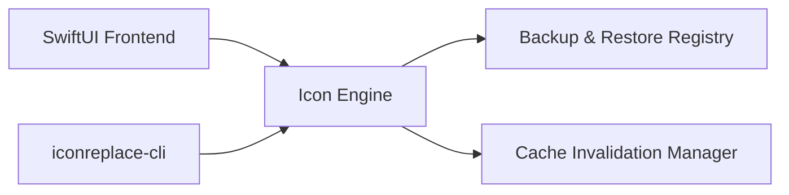

# AGENTS.md - Workspace Guidelines & Architecture Principles

Welcome to the project repository workspace. This document defines operating rules, sandbox safety constraints, token efficiency guidance, and architectural principles for AI agents working within this workspace.

---

## 1. Project Overview & Operating Guidelines

- **Workspace Path:** `/Users/davejski/Documents`
- **Primary Domain:** macOS application development, system utilities (`IconReplace.app`), design specifications, and developer tooling.
- **Role & Expectations:** AI agents operating in this repository act as autonomous pair programmers, triage leads, and architects. Agents must plan rigorously, verify changes with concrete commands, and adhere to strict safety boundaries.

---

## 2. Sandbox Safety Rules & Operating Safeguards

AI agents operate directly on the native host OS (`macOS`). Every file operation, terminal command, and system invocation executes on the local host machine.

### Critical Process Management & Protected Master Agents Rule
> [!CAUTION]
> **NEVER execute `killall`, `pkill`, or process termination commands targeting active AI master agents, IDEs, or system processes.**

- **Protected AI Master Agents & Process Safety:** NEVER attempt to kill, terminate, signal, or restart `Antigravity`, `gemini`, `codex`, `claude`, `kimi`, `opencode`, or any running AI agent harness, IDE, or developer environment on the system.
- **Subagent Execution & Workspace Isolation:** Subagents must restrict write operations strictly to the designated project repository. Subagents are strictly forbidden from touching or modifying other user repositories, system applications, or config directories without explicit user authorization.
- **Isolated Test Verification Mandate:** All unit tests, test suites, and verification scripts executed by subagents MUST run inside isolated temporary directories (`tempfile`) with live OS side-effects explicitly disabled. Testing MUST NEVER trigger live system process restarts (`killall Dock`, `killall Finder`, OS configuration changes, or desktop flashes).
- **Targeted Live Swaps Only:** Live process/cache refreshes (`killall Dock`) are strictly limited to explicit, user-initiated runtime actions—never during background testing, build checks, or automated verification.
- **Destructive Deletion Policy:** Never execute `rm -rf`, `rmdir`, `git clean -f`, or destructive resets without explicit user authorization. Use reversible trash staging (`.trash/<UTC timestamp>/`) when cleanup is required.
- **Secret Redaction:** Never print, log, or commit secret keys, credentials, API tokens, or private keys. Redact sensitive values (`ctx7sk-***`, `<REDACTED>`).

---

## 3. Token Efficiency Guidance

To maintain high reasoning quality while conserving context window capacity:

- **Search Before Reading:** Use targeted search (`grep_search` or `codebase_search`) before inspecting large files.
- **Narrow File Views:** Use `view_file` with precise `StartLine` and `EndLine` parameters rather than viewing multi-thousand-line files in full.
- **Synthesized Subagent Communications:** Do not output or forward uncompacted raw transcripts. Return concise, high-density progress receipts and actionable summaries.
- **Minimal Tool Invocations:** Choose the smallest effective combination of tool calls required to complete a task.

---

## 4. `IconReplace.app` Architecture Principles

`IconReplace.app` is a native macOS application and command-line utility for managing, customizing, backing up, and restoring macOS application icons.

### Architecture Core Principles
1. **Backup-First Mutation:** No application icon or bundle attribute may be modified without first creating a byte-for-byte backup in `~/.iconreplace/backups/<bundle_id>/`.
2. **Dual-Layer Icon Customization:**
   - **Bundle Asset Level:** Updates `Contents/Resources/AppIcon.icns` inside target `.app` bundle.
   - **Extended Attribute Level:** Sets custom icon bit flag (`SetFile -a C`) and appends `com.apple.ResourceFork` / `Icon\r` extended file attribute.
3. **Isolated Cache Invalidation:** System icon caches are refreshed via `touch /Applications/<Target>.app`, `qlmanage -r cache`, and targeted restarts of `Dock` and `Finder` only.
4. **Idempotent Restoration:** Restoring an original app icon must completely remove custom `Icon\r` extended attributes and restore original bundle contents to an identical pre-modification state.
5. **Decoupled CLI & GUI:** Core business logic resides in an isolated `IconEngineCore` framework shared equally by `IconReplace.app` (SwiftUI UI) and `iconreplace-cli`.

---

## 5. Verification & Evidence-Based Completion

- **Evidence Before Assertions:** Never declare a feature complete or a bug fixed until running verification scripts or build checks and inspecting clean output.
- **Status Ladder:** Follow verification progression: `component-verified` → `integrated` → `drill-proven`.
- **Traceability:** Keep design specifications updated in `docs/superpowers/specs/`.
